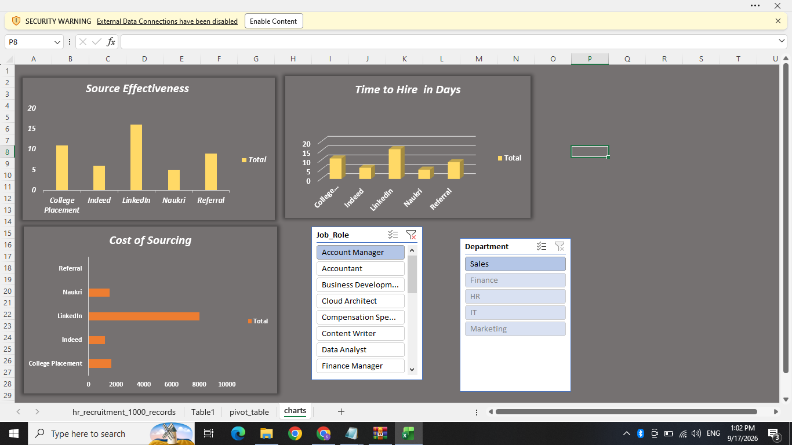

# HR-Analytics-Talent-Acquisition
An interactive Excel dashboard analyzing recruitment sources, cost-per-hire, and time-to-hire metrics for 1,000 candidate records

# Talent Acquisition Performance Dashboard

## Project Overview
This project focuses on optimizing recruitment efficiency using a dataset of 1,000 candidate applications across multiple hiring departments. 

## Key Metrics Analyzed
 *Time-to-Hire : Measured operational speed from application date to final job offer.
 *Cost-Per-Hire : Calculated sourcing expenses to pinpoint budget optimization channels.
 *Source Efficiency : Identified which platforms (LinkedIn, Indeed, Referrals) yield the highest success rates.

## Dashboard Preview

## Tools Used
 *Advanced Excel : Data modeling, Pivot Tables, logical formulas (`IF`, date calculations).
 *Power Query : ETL processes, handling missing values, and data type formatting.
